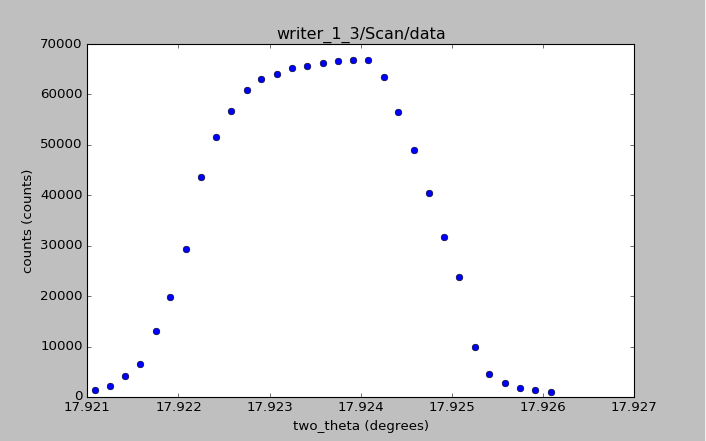

APS 2016 Python lecture 5
===========================

Python code and resources used in APS 2016 Python lecture 5

Goals
------

Make basic characterizations of diffraction peak from HDF5 file data

* print peak position
* print center of mass (COM)
* print full-width at half maximum (FWHM)

Given
-----

* data describes a diffraction peak profile: intensity *vs.* angle
* use actual data from an APS beam line
* use HDF5 data file

Overview
--------

The functions to compute these terms have been coded in Python directly
and are placed in a library file with the code. The *h5py* package used
to read the data file stores data from the file in memory using data
structures from the *numpy* package. For the purposes of demonstration,
the library functions created for this lecture have been written to
avoid direct calls to *numpy* routines.

The data file chosen for this example is from `the NeXus
manual <http://download.nexusformat.org/doc/html/examples/h5py>`__. 
A graph of this data is provided.

   graph of writer_1_3.hdf5:/Scan/data

Physically, the data are from a Si (220) crystal Bragg reflection
*rocking curve* measurement using 10.5 keV X-rays from the USAXS
instrument when it was at APS beam line 32ID, recorded by SPEC on
2010-04-25. This scan is part of a `routine alignment process 
<http://usaxs.xray.aps.anl.gov/livedata/specplots/2010/04/04_25/>`__ 
of the USAXS instrument.

References
----------

**FWHM**: https://en.wikipedia.org/wiki/Full\_width\_at\_half\_maximum

**h5py**: http://www.h5py.org

**numpy**: http://www.numpy.org

**NeXus**:
http://download.nexusformat.org/doc/html/examples/h5py/index.html

**SPEC**: http://certif.com
